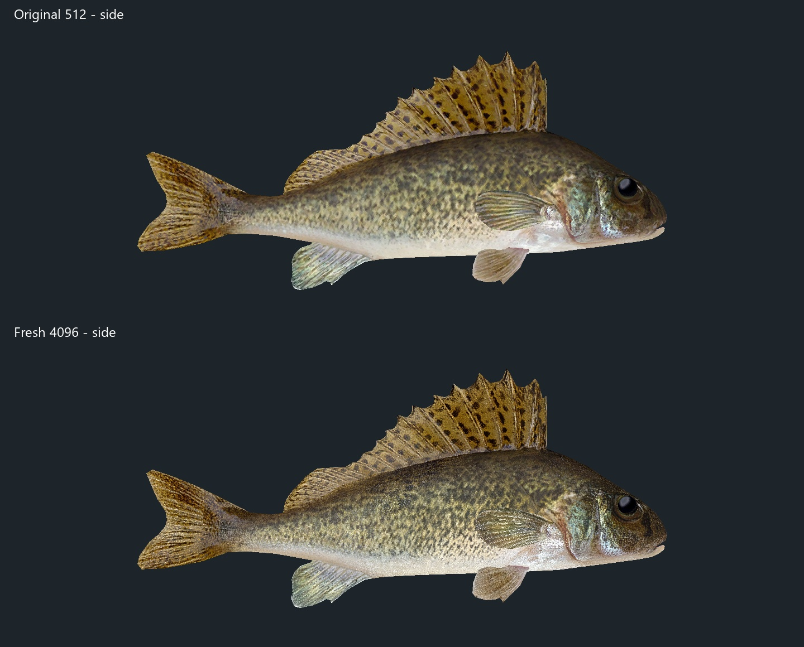
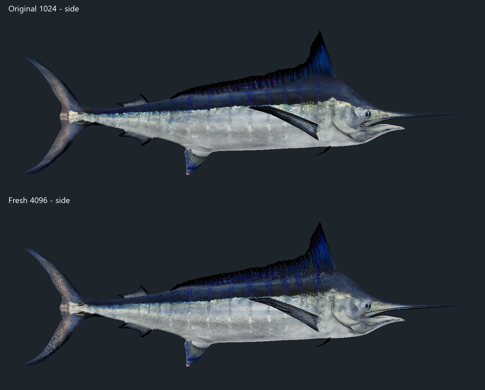
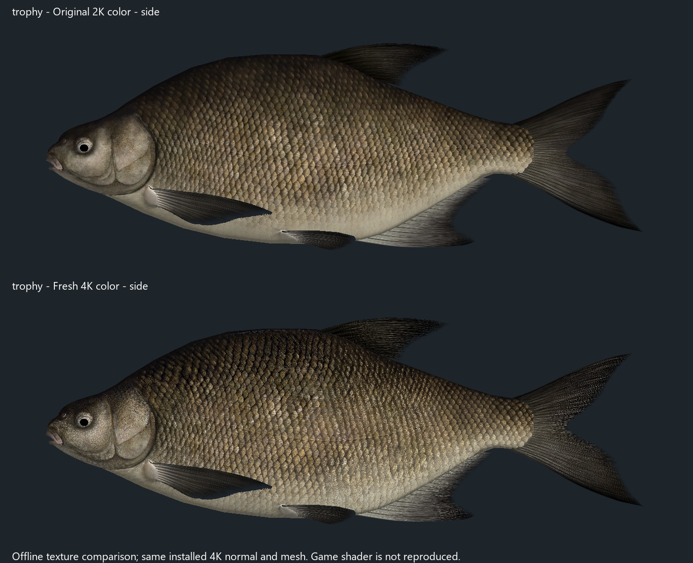
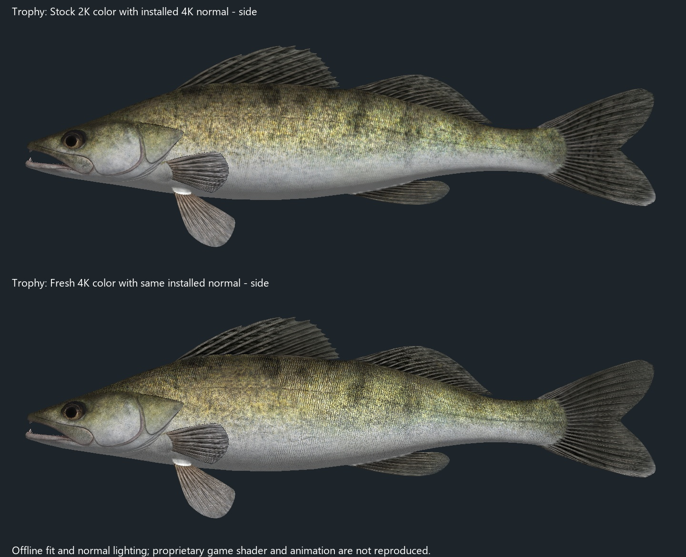

# Fisher Online 4K Fish Textures

An ongoing high-resolution texture and material overhaul for **Fisher Online**.
The pack rebuilds fish color maps at 4096x4096, preserves the original UV
layouts, and adds restrained species-appropriate normal-map detail where the
game materials support it.

Release **0.1.0** contains 34 verified bundle patches covering the completed
fish set listed in [docs/SPECIES.md](docs/SPECIES.md). It includes normal,
large, and trophy appearances when those variants exist in the same bundle or
have dedicated bundles in the game.

## Install

1. In Steam, right-click **Fisher Online**, select **Properties > Installed
   Files > Verify integrity of game files**, and let it finish. This gives the
   installer the exact supported source version.
2. Close Fisher Online.
3. Download `FisherOnline-4K-Fish-Textures-v0.1.0.zip` from the latest GitHub
   release and extract it to a normal folder.
4. Open PowerShell in the extracted folder and run:

   ```powershell
   powershell -NoProfile -ExecutionPolicy Bypass -File .\Install-Fisher4K.ps1
   ```

   If Steam is installed somewhere unusual, supply the game folder:

   ```powershell
   powershell -NoProfile -ExecutionPolicy Bypass -File .\Install-Fisher4K.ps1 -GamePath "D:\SteamLibrary\steamapps\common\theFisher Online"
   ```

The installer performs a full preflight before writing anything. It refuses to
run while the game is open, verifies every source bundle and patch with
SHA-256, creates a dated backup under `theFisher Online\Mod Backups`, stages
each replacement, verifies the result, and rolls back the batch if any step
fails. It does not terminate the game process.

To check compatibility without installing:

```powershell
powershell -NoProfile -ExecutionPolicy Bypass -File .\Install-Fisher4K.ps1 -VerifyOnly
```

## Restore

Close Fisher Online, then pass the dated backup directory printed by the
installer:

```powershell
powershell -NoProfile -ExecutionPolicy Bypass -File .\Restore-Fisher4K.ps1 -BackupPath "D:\SteamLibrary\steamapps\common\theFisher Online\Mod Backups\FisherOnline-4K-Public-before-YYYYMMDD-HHMMSS"
```

Steam's **Verify integrity of game files** also restores the official bundles.

## Compatibility and performance

- The release is version-locked to the game bundle hashes in `manifest.json`.
  Unknown or already-modified source bundles are rejected before installation.
- Another mod that replaces one of the same fish bundles must be removed first.
- 4K textures consume more VRAM than the original 256-1024px assets. Systems
  near their VRAM limit may show longer loading or texture streaming stutter.
- This is an unofficial visual mod and is not affiliated with the Fisher Online
  developers.

## Release format

The archive contains compressed `.f4kp` binary patches rather than copies of
the original game bundles. Each patch can be applied only to the exact source
SHA-256 recorded in the manifest. The repository contains the patch builder,
installer, verification tooling, documentation, and comparison images.

The project remains in active development as the rest of the fish catalog is
rebuilt and verified.

## Comparisons

Each comparison uses the original game mesh and UVs. The original texture is
shown on top and the rebuilt 4K texture on the bottom.

| Ruffe | Blue Marlin |
|---|---|
|  |  |

| Common Bream Trophy | Zander Trophy |
|---|---|
|  |  |

More comparison renders are available in the [`previews`](previews) folder.
