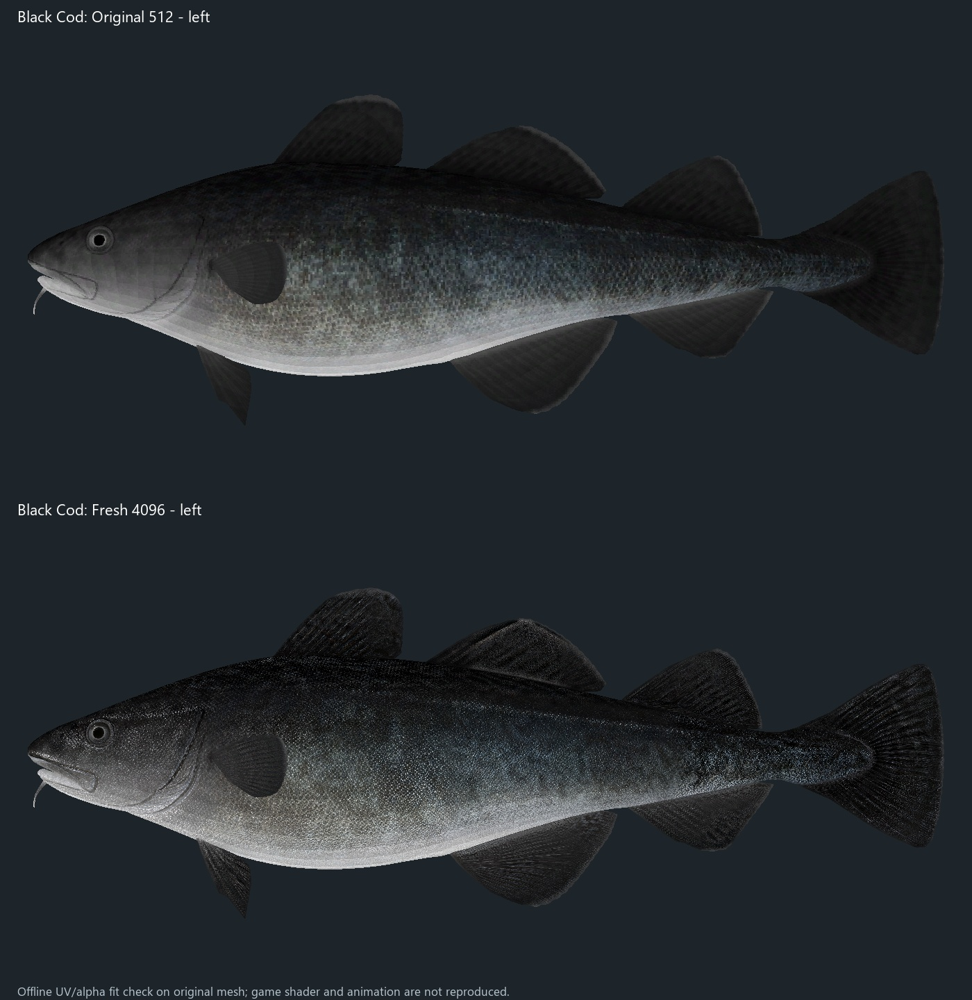
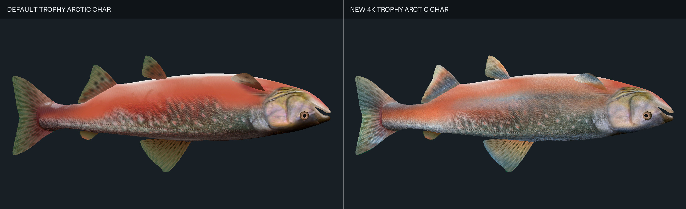
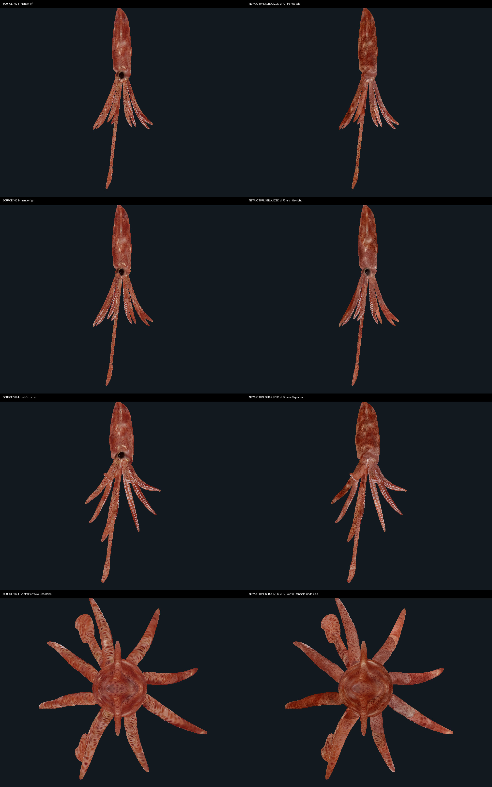

# Fisher Online 4K Fish Textures

An ongoing high-resolution texture and material overhaul for **Fisher Online**.
The pack rebuilds fish color maps at 4096x4096, preserves the original UV
layouts, and adds restrained species-appropriate normal-map detail where the
game materials support it.

Release **0.1.4** contains **133 journal-backed bundle patches** from the
current 310-bundle live inventory. Every included patch was rebuilt only after
its installed live SHA-256 matched a unique successful journal lineage and an
independently retained, authoritative pristine original. The release includes normal,
large, and trophy appearances where the game has dedicated bundles.

## Install

1. In Steam, right-click **Fisher Online**, select **Properties > Installed
   Files > Verify integrity of game files**, and let it finish. This gives the
   installer the exact supported source version.
2. Close Fisher Online.
3. Download and extract every `v0.1.4` release part into separate normal
   folders. Run each part's installer once; the order does not matter. The
   archive split keeps every GitHub release asset safely below its 2 GiB limit.
4. Open PowerShell in the extracted folder and run:

   ```powershell
   powershell -NoProfile -ExecutionPolicy Bypass -File .\Install-Fisher4K.ps1 -GamePath "C:\Program Files (x86)\Steam\steamapps\common\theFisher Online"
   ```

   Replace that path if Steam is installed somewhere else:

   ```powershell
   powershell -NoProfile -ExecutionPolicy Bypass -File .\Install-Fisher4K.ps1 -GamePath "D:\SteamLibrary\steamapps\common\theFisher Online"
   ```

Each part's installer performs a full preflight before writing anything. It
refuses to run while the game is open, verifies every source bundle and patch
with SHA-256, creates a dated backup under `theFisher Online\Mod Backups`,
stages each replacement, verifies the result, and rolls back that batch if any
step fails. It does not terminate the game process.

To check compatibility without installing:

```powershell
powershell -NoProfile -ExecutionPolicy Bypass -File .\Install-Fisher4K.ps1 -GamePath "C:\Program Files (x86)\Steam\steamapps\common\theFisher Online" -VerifyOnly
```

## Restore

Close Fisher Online, then pass the dated backup directory printed by the
installer:

```powershell
powershell -NoProfile -ExecutionPolicy Bypass -File .\Restore-Fisher4K.ps1 -GamePath "D:\SteamLibrary\steamapps\common\theFisher Online" -BackupPath "D:\SteamLibrary\steamapps\common\theFisher Online\Mod Backups\FisherOnline-4K-Public-before-PART01","D:\SteamLibrary\steamapps\common\theFisher Online\Mod Backups\FisherOnline-4K-Public-before-PART02","D:\SteamLibrary\steamapps\common\theFisher Online\Mod Backups\FisherOnline-4K-Public-before-PART03"
```

Steam's **Verify integrity of game files** also restores the official bundles.

## Compatibility and performance

- Each archive is version-locked to the pristine game bundle hashes in its
  `manifest.json`. Installed bundles already at the expected target hash are
  accepted, so all release parts can be applied safely after Steam Verify
  Integrity restores pristine bundles.
  Unknown or already-modified source bundles are rejected before installation.
- Another mod that replaces one of the same fish bundles must be removed first.
- 4K textures consume more VRAM than the original 256-1024px assets. Systems
  near their VRAM limit may show longer loading or texture streaming stutter.
- This is an unofficial visual mod and is not affiliated with the Fisher Online
  developers.

## Release format

Each archive contains compressed `.f4kp` binary patches rather than copies of
the original game bundles. A patch can be applied only to the exact source
SHA-256 recorded in its manifest. The repository contains the journal-backed
patch builder, installer, verification tooling, documentation, and comparison
images.

The project remains in active development as the rest of the fish catalog is
rebuilt and verified.

## Comparisons

Each comparison uses the original game mesh and UVs. The original texture is
shown on top and the rebuilt 4K texture on the bottom.

| Ruffe | Blue Marlin |
|---|---|
|  |  |

| Common Bream Trophy | Zander Trophy |
|---|---|
|  |  |

| Black Cod |
|---|
|  |

| Arctic Char | Squid |
|---|---|
|  |  |

More comparison renders are available in the [`previews`](previews) folder.
